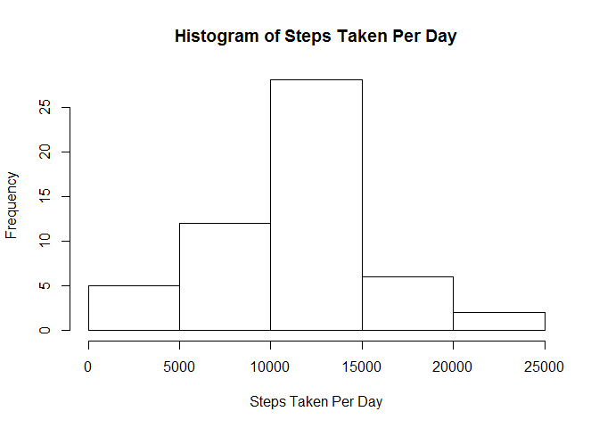
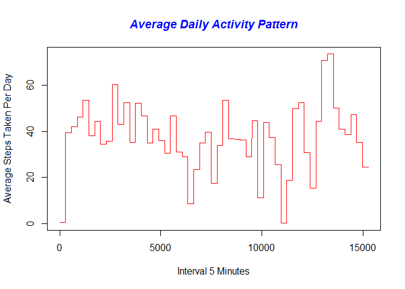
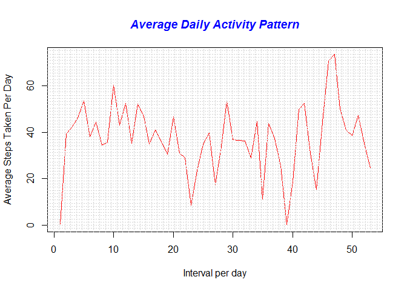
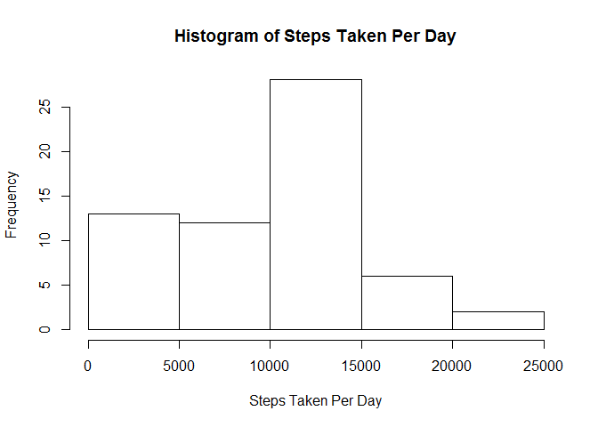
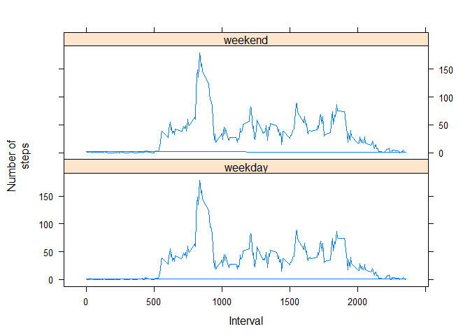
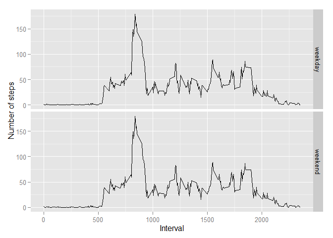

# Reproducible Research: Peer Assessment 1
Load Libraries for the project. 
 

```r
library(dplyr)
```

```
## 
## Attaching package: 'dplyr'
## 
## The following objects are masked from 'package:stats':
## 
##     filter, lag
## 
## The following objects are masked from 'package:base':
## 
##     intersect, setdiff, setequal, union
```

```r
library(gdata)
```

```
## gdata: Unable to locate valid perl interpreter
## gdata: 
## gdata: read.xls() will be unable to read Excel XLS and XLSX files
## gdata: unless the 'perl=' argument is used to specify the location
## gdata: of a valid perl intrpreter.
## gdata: 
## gdata: (To avoid display of this message in the future, please
## gdata: ensure perl is installed and available on the executable
## gdata: search path.)
## gdata: Unable to load perl libaries needed by read.xls()
## gdata: to support 'XLX' (Excel 97-2004) files.
## 
## gdata: Unable to load perl libaries needed by read.xls()
## gdata: to support 'XLSX' (Excel 2007+) files.
## 
## gdata: Run the function 'installXLSXsupport()'
## gdata: to automatically download and install the perl
## gdata: libaries needed to support Excel XLS and XLSX formats.
## 
## Attaching package: 'gdata'
## 
## The following objects are masked from 'package:dplyr':
## 
##     combine, first, last
## 
## The following object is masked from 'package:stats':
## 
##     nobs
## 
## The following object is masked from 'package:utils':
## 
##     object.size
```

```r
library(lattice)
library(data.table)
```

```
## 
## Attaching package: 'data.table'
## 
## The following object is masked from 'package:gdata':
## 
##     last
## 
## The following objects are masked from 'package:dplyr':
## 
##     between, last
```

```r
library(timeDate)
```

```
## Warning: package 'timeDate' was built under R version 3.2.3
```

```r
library(ggplot2)
```

Unzip and Load Unzipped Data using read.csv command


```r
unzip("C:/Users/girish/Documents/data/repdata-data-activity.zip", exdir = "C:/Users/girish/Documents/data")
PAD <- read.csv("C:/Users/girish/Documents/data/activity.csv")
```
Clean Data to remove NA value Rows from the data get a sum of steps taken per day


```r
PAD1 <- PAD[complete.cases(PAD),]
PAD1 <- data.table(PAD1)
PAD2 <- PAD1[,sum(steps), by = date]
PAD3 <- data.frame(PAD2)
colnames(PAD3) <- c("date", "steps")
```


```r
hist(PAD3$steps, main = paste("Histogram of Steps Taken Per Day"),xlab = ("Steps Taken Per Day"))
```

 

```r
ActivityMean <- mean(PAD3$steps)
ActivityMedian <- median(PAD3$steps)
ActivityMean
```

```
## [1] 10766.19
```

```r
ActivityMedian
```

```
## [1] 10765
```

Group the data by date and find the avaerage number of steps taken per day
Plot a graph of the 5-minute interval that, on average, contains the maximum number of steps
Find Max average interval 

```r
    PAD4 <- group_by(PAD1,date)
    PAD5 <- mutate(PAD4,average = mean(steps))
    plot(PAD5$average,type = "l",col="red", ann=FALSE)
    title(main="Average Daily Activity Pattern", col.main="blue", font.main = 4)
    title(xlab="Interval 5 Minutes")
    title(ylab="Average Steps Taken Per Day")
```

 

```r
    plot(unique(PAD5$average),type = "l",col="red", ann=FALSE)
    title(main="Average Daily Activity Pattern", col.main="blue", font.main = 4)
    title(xlab="Interval per day")
    title(ylab="Average Steps Taken Per Day")
    grid(nx = 58)
```

 

```r
    Max_Avg <-filter(PAD5, average == max(average))
    Max_Avg
```

```
## Source: local data table [288 x 4]
## 
##    steps       date interval  average
##    (int)     (fctr)    (int)    (dbl)
## 1      0 2012-11-23        0 73.59028
## 2      0 2012-11-23        5 73.59028
## 3      0 2012-11-23       10 73.59028
## 4      0 2012-11-23       15 73.59028
## 5      0 2012-11-23       20 73.59028
## 6      0 2012-11-23       25 73.59028
## 7      0 2012-11-23       30 73.59028
## 8      0 2012-11-23       35 73.59028
## 9      0 2012-11-23       40 73.59028
## 10     0 2012-11-23       45 73.59028
## ..   ...        ...      ...      ...
```
Find Total Number of na fill missing values by 0, make a Histogram

```r
    PAD6 <- mutate(PAD, na = is.na(steps))
    Total_NA_Steps <- sum(PAD6$na)
    Total_NA_Steps
```

```
## [1] 2304
```

```r
    PAD6$steps[is.na(PAD6$steps)] <- 0
    PAD6 <- data.table(PAD6)
    PAD7 <- PAD6[,sum(steps), by = date]
    PAD7 <- data.frame(PAD7)
    colnames(PAD7) <- c("date", "steps")
    hist(PAD7$steps, main = paste("Histogram of Steps Taken Per Day"),xlab = ("Steps Taken Per Day"))
```

 

```r
    ActivityMean1 <- mean(PAD7$steps)
    ActivityMedian1 <- median(PAD7$steps)
    ActivityMean1
```

```
## [1] 9354.23
```

```r
    ActivityMedian1
```

```
## [1] 10395
```
The impact of imputing missing data on the estimates of the total daily number of steps is the 
Activity Mean and Median has gone down


```r
    Weekday <- isWeekday(PAD6$date, wday=1:5)
    PAD8 <- cbind(PAD6, Weekday)
    

    for (i in 1:17568) {
        if (PAD8$Weekday[i] == TRUE){PAD8$Weekday[i] = "weekday"}}
    for (i in 1:17568) {
        if (PAD8$Weekday[i] == FALSE){PAD8$Weekday[i] = "weekend"}}
    
    PAD8 <- group_by(PAD8,interval)
    
    PAD9 <- mutate(PAD8,average = mean(steps))
    PAD9 <- data.table(PAD9)    
    xyplot(average ~ interval| Weekday, data = PAD9, type = "l",xlab = "Interval",ylab = "Number of
       steps",layout=c(1,2))
```

 

```r
    ggplot(PAD9, aes(interval, average)) + geom_line() + xlab("Interval") + ylab("Number of steps") + 
        facet_grid(Weekday ~ .)
```

 

